# Transit Arrivals

A Pebble watchapp showing live rail countdowns for ten North American transit systems, backed by a Cloudflare Worker.

<p align="center">
  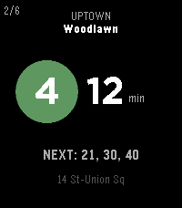
  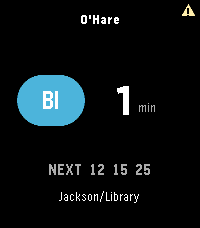
  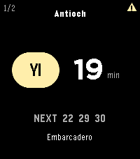
</p>

The app opens to the nearest station's departure board: line bullet in the line's color, destination headsign, a countdown, and the next few trains. UP/DOWN scrolls lines, SELECT flips direction, holding UP/DOWN steps through saved stations.

## Systems

| City | System | Coverage | Data |
| --- | --- | --- | --- |
| New York | MTA Subway + PATH | every line, every station | GTFS-RT, fetched on-phone |
| Chicago | CTA 'L' | all eight lines | Train Tracker |
| Washington DC | Metro (WMATA) | all six lines | live |
| Atlanta | MARTA | all four lines | live |
| SF Bay Area | BART | every line | live, with a fallback feed |
| Boston | MBTA | Red/Orange/Blue/Green + Mattapan | live |
| Philadelphia | SEPTA | Metro + Regional Rail | live; the L and B publish no realtime and show `NO DATA` |
| Cleveland | GCRTA | Red + Blue/Green/Waterfront | live |
| Philadelphia / South Jersey | PATCO Speedline | every station | GTFS timetable, marked `SCHED` |
| San Juan | Tren Urbano | every station | GTFS timetable, marked `SCHED` |

Miami Metrorail/Metromover, Baltimore Metro/Light Rail, and Honolulu Skyline are fully wired but disabled until their API keys are configured (one Worker secret plus one line in `src/pkjs/lib/stations.js`).

## Features

- Nearest station by GPS. Multi-entrance complexes match from the closest platform, not a single centroid.
- Up to 10 favorites, agency-scoped, managed from a phone config page with per-city filters, reordering, and optional labels.
- Service alerts and suspensions: a badge on the board, full text in the menu, suspended lines shown as banners.
- Timetable-based systems carry an amber `SCHED` badge; a feed that fails (after one automatic retry) shows its lines as `NO DATA`; stale data gets an offline card; outside the covered systems the app says so.
- The last board is cached on-watch and shown immediately at launch while fresh data loads.
- App glance: the launcher tile shows the next departure for the last station, expiring when that train leaves.
- Builds for basalt, chalk, diorite, emery, flint, and gabbro, with layouts tuned for rect and round.

<p align="center">
  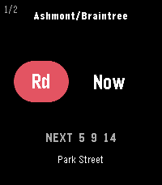
  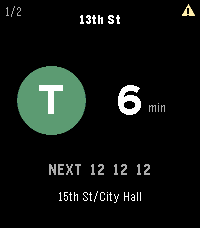
  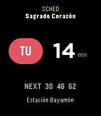
  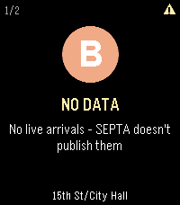
</p>
<p align="center">
  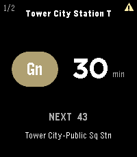
  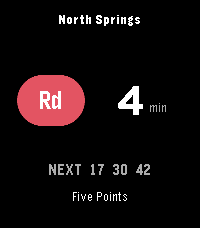
  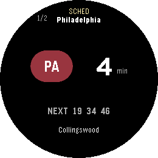
  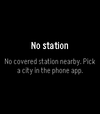
</p>

All screenshots were captured live from the emulator.

## Architecture

```
+-------------+  AppMessage   +------------------+   HTTPS    +---------------------+
|  Watch (C)  | <------------ |  Phone (PKJS)    | <--------- |  Cloudflare Worker  |
|  src/c/     |  binary v8    |  src/pkjs/       |    JSON    |  cta-proxy/         |
|  UI, cache, |  "bundle"     |  station DBs,    |            |  11 agency adapters |
|  favorites  | ------------> |  geolocation,    |            |  + GTFS-RT decoder  |
+-------------+   requests    |  MTA direct      |            |  + timetable engine |
                              +------------------+            +---------------------+
```

- `src/c/`: the watchapp. Rendering, the binary bundle decoder, chunked persist cache, favorites, app glance.
- `src/pkjs/`: phone-side JS. Resolves the station (GPS or favorite), fetches arrivals (MTA's GTFS-RT feeds directly, everything else through the Worker), encodes the wire bundle. Station directories live in `lib/*.stations.json`.
- `cta-proxy/`: one Cloudflare Worker that proxies and normalizes every non-MTA agency behind a single response shape, with a GTFS-RT protobuf decoder and a GTFS timetable engine for the scheduled systems. Routes, caching, and the secrets table are in [`cta-proxy/README.md`](cta-proxy/README.md).
- `tools/`: Node builders that regenerate each agency's station data from its GTFS feed. See [`tools/README.md`](tools/README.md).

A parity test asserts the phone registry, station DBs, config page, and Worker routes agree, so an agency cannot ship half-wired.

## Building

Standard [Pebble SDK](https://developer.rebble.io/) workflow from the repo root:

```sh
pebble build
pebble install --emulator emery     # or basalt/chalk/diorite/flint/gabbro, or a watch
```

## Tests

Two suites, two runners.

Phone JS and tools use Node's built-in `node:test`; pass the files explicitly:

```sh
node --test src/pkjs/lib/*.test.js tools/*.test.js tools/lib/*.test.js
```

The Worker uses vitest:

```sh
cd cta-proxy && npx vitest run
```

The Worker deploys with `npx wrangler deploy` from `cta-proxy/`.

## Adding a system

Adding an agency touches: a station builder (plus test) in `tools/`, the generated station JSON, a Worker adapter module (plus fixture test) and two router lines, one phone-registry line, and a config-page chip. The parity test fails until all of them agree. The recipe is in [`tools/README.md`](tools/README.md) and [`cta-proxy/README.md`](cta-proxy/README.md).

## Names

The Worker directory and deployed URL are `cta-proxy`; it originally served only CTA. The URL is baked into shipped watchapps, so the name stays.

## License

MIT
