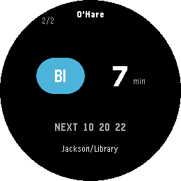
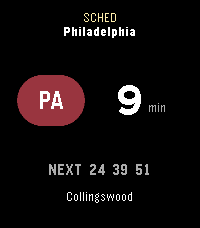

# Transit Arrivals

**The next train, on your wrist.** Live rail countdowns for ten North American transit systems (and counting) on every modern Pebble.

<p align="center">
  
  
  
</p>

Open the app and the nearest station's departure board is already on screen — line bullet in its real color, destination headsign, a big countdown, and the next few trains after it. Scroll lines with UP/DOWN, flip direction with SELECT, hold UP/DOWN to step through your saved stations. That's the whole interface.

All screenshots in this README are real boards captured live from the emulator.

## Systems

| City | System | Coverage | Data |
| --- | --- | --- | --- |
| New York | MTA Subway + PATH | every line, every station | live (GTFS-RT, fetched on-phone) |
| Chicago | CTA 'L' | all eight lines | live (Train Tracker) |
| Washington DC | Metro (WMATA) | all six lines | live |
| Atlanta | MARTA | all four lines | live |
| SF Bay Area | BART | every line | live (+ fallback feed) |
| Boston | MBTA | Red/Orange/Blue/Green + Mattapan | live |
| Philadelphia | SEPTA | Metro (L/B/T/M/G/D) + Regional Rail | live where SEPTA publishes it; honest `NO DATA` where it doesn't |
| Cleveland | GCRTA | Red + Blue/Green/Waterfront | live |
| Philadelphia / South Jersey | PATCO Speedline | every station | official timetable, marked `SCHED` |
| San Juan | Tren Urbano | every station | official timetable, marked `SCHED` |

Miami Metrorail/Metromover, Baltimore Metro/Light Rail, and Honolulu Skyline are fully built in and ship hidden — each goes live the day its API key lands (one secret + one line). More systems are planned.

## What "premium" means here

- **Nearest station by GPS**, with multi-entrance complexes matched from whichever entrance you're actually at — coverage hugs the platforms, not a single point.
- **Up to 10 favorites**, agency-scoped, managed from a polished phone config page with per-city filter chips, reorderable, with optional labels ("Home", "Work").
- **Service alerts and suspensions**: an alert badge on the board, full text one menu away, and suspended lines shown as banners rather than silently missing.
- **Honesty as a feature.** Timetable-derived times carry an amber `SCHED` badge — never dressed up as live. A feed that fails (after one automatic retry) shows its lines as `NO DATA` instead of hiding them. Stale data gets an offline card, not a ghost board. Outside the covered systems you're told so, not handed a fake board.
- **Instant launch**: your last board is cached on-watch and flips in immediately while fresh times load behind it.
- **App glance**: the launcher tile shows the next departure for your last station, expiring exactly when that train leaves.
- **Every Pebble platform**: basalt, chalk, diorite, emery, flint, gabbro — color and b/w, rect and round, with layouts tuned per shape.

<p align="center">
  
  
  
  
</p>
<p align="center">
  
  
  
  
</p>

## Architecture

```
┌─────────────┐  AppMessage   ┌──────────────────┐   HTTPS    ┌─────────────────────┐
│  Watch (C)  │ ◄──────────── │  Phone (PKJS)    │ ◄───────── │  Cloudflare Worker  │
│  src/c/     │  binary v8    │  src/pkjs/       │    JSON    │  cta-proxy/         │
│  UI, cache, │  "bundle"     │  station DBs,    │            │  11 agency adapters │
│  favorites  │ ────────────► │  geolocation,    │            │  + GTFS-RT decoder  │
└─────────────┘   requests    │  MTA direct      │            │  + timetable engine │
                              └──────────────────┘            └─────────────────────┘
```

- **`src/c/`** — the watchapp: rendering (Solari-flap loading animation, per-platform layouts), chunked persist cache, favorites, the binary bundle decoder, app glance.
- **`src/pkjs/`** — phone-side JS: resolves the station (GPS or favorite), fetches arrivals (MTA's GTFS-RT feeds directly; everything else through the worker), encodes the wire bundle. Station directories live in `lib/*.stations.json`.
- **`cta-proxy/`** — one Cloudflare Worker proxying and normalizing every non-MTA agency behind a single response shape, with a hand-rolled GTFS-RT protobuf decoder and a GTFS timetable engine for the scheduled systems. See [`cta-proxy/README.md`](cta-proxy/README.md) for routes, caching, and the secrets table.
- **`tools/`** — Node builders that regenerate each agency's station data from its GTFS feed. See [`tools/README.md`](tools/README.md).

A cross-layer parity test keeps the phone registry, station DBs, config page, and worker routes in lockstep — an agency can't ship half-wired.

### A note on names

The worker directory and URL say `cta-proxy` because the worker began life proxying only Chicago. It now serves eleven agencies, but its deployed URL is baked into shipped watchapps, so the name stays.

## Building

Standard [Pebble SDK](https://developer.rebble.io/) workflow from the repo root:

```sh
pebble build
pebble install --emulator emery     # or basalt/chalk/diorite/flint/gabbro, or a watch
```

## Tests — two runners, don't mix them

**Phone JS + tools** use Node's built-in `node:test`; pass the files explicitly:

```sh
node --test src/pkjs/lib/*.test.js tools/*.test.js tools/lib/*.test.js
```

**The worker** uses vitest:

```sh
cd cta-proxy && npx vitest run
```

Both suites must be green before a release; the worker deploys with `npx wrangler deploy` from `cta-proxy/`.

## Adding a system

Adding agency #14 touches a handful of well-defined points: a station builder (+test) in `tools/`, the generated station JSON, a worker adapter module (+fixture test) and two router lines, one phone-registry line, and a config-page chip. The parity test fails until all of them agree. The full recipe lives in [`tools/README.md`](tools/README.md) and [`cta-proxy/README.md`](cta-proxy/README.md).
